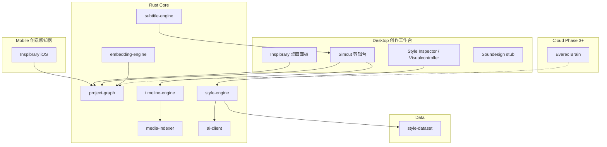

# Everec（每刻）产品需求文档

| 字段 | 内容 |
|------|------|
| 产品名 | **Everec / 每刻** |
| 状态 | 草案 v0.2 |
| 更新日期 | 2026-06-01 |
| 来源 | 历史规划 [Everec 每刻 Creative OS MVP](file:///Users/cassini/.cursor/plans/easycut_creative_os_mvp_8384c533.plan.md)（原 easycut 更名 everec） |
| 仓库 | `/Users/cassini/Desktop/everec` |

---

## 0. 文档说明

本文档整合 **历史对话与 MVP 计划** 中的完整产品定义，包括但不限于：

- **Inspibrary**（灵感库）— 桌面面板 + iOS 独立 App  
- **Simcut**（剪辑台 / AI 剪辑工作台）— 桌面核心  
- **Project Graph**（项目知识图谱）— 一等公民数据模型  
- **Style Dataset**（风格知识库）  
- **Visualcontroller**、**Soundesign**、**Everec Brain** 及暂缓模块 **Starthinking**、**Prerector**

> **与当前仓库的差异：** 计划要求 Tauri + FFmpeg + `project-graph` 等；仓库现阶段存在 `audio-engine` / `instruments` 脚手架（偏音乐），与 Creative OS 主路线不一致。**以本文 PRD 为产品真源**；实现应回归计划中的 monorepo 结构（见 §8）。

---

## 1. 一句话定位

**中文：** Everec 每刻 — **创作者认知增强系统**。懂审美的 AI 原生 **Creative OS**，从灵感感知到成片交付。

**英文：** Everec — Creator cognitive enhancement system for visual storytellers. From creative capture to final cut.

**三层定义：**

| 层级 | 说法 |
|------|------|
| 不是什么 | 不是「又一个 AI 剪辑软件」、不是手机版剪映 |
| 是什么 | 帮创作者**理解、积累、复用审美语言**的创作操作系统 |
| 核心资产 | **Style Dataset + Project Graph**，不是时间轴 UI 本身 |

**闭环（市场缺口）：**

```text
灵感采集 → 风格解析 → Prompt 可控剪辑 → 导出交付
```

市面产品分块占领（Runway/Descript/CapCut、Eagle/Milanote、Frame.io 等），**没有人把整条链做成一体**。

---

## 2. 问题与机会

### 2.1 创作者痛点

| 环节 | 现有工具 | 缺口 |
|------|----------|------|
| AI 剪辑 | Runway Edit Studio、Descript、CapCut | 生成/字幕强，**审美理解弱**，工作流断裂 |
| 对话式编辑 | Gemini Omni 等 | Prompt 改视频，**无色彩/字体/镜头语言体系** |
| 灵感管理 | Eagle、Milanote、Pinterest | 收藏强，**与剪辑不打通** |
| 协作制片 | Frame.io、Notion | 审片/任务，**不懂视觉语言** |
| 创意 OS 雏形 | Kaiber Superstudio | 偏艺术生成，**非轻量成片** |

### 2.2 Everec 的机会

用 **本地优先** 的 Rust 核心 + 统一 **Project Graph**，把灵感资产与剪辑决策绑在同一图谱上，AI 负责「识别 → 命名 → 教学 → 可撤销实现」，而不是端到端黑盒生成。

---

## 3. 产品目标与非目标

### 3.1 目标（12 个月内 MVP → 公开 Beta）

| 目标 | 度量 |
|------|------|
| 桌面闭环 | 灵感入库 → Simcut 剪辑 → 1080p 导出，Project Graph 全程可追溯 |
| 灵感库可用 | 桌面 Inspibrary：导入、AI 标签、语义搜索、一键创建 Simcut 项目 |
| 风格可复用 | 参考静帧 → LUT/色彩建议 → 一键应用；写入图谱 |
| Prompt 可控 | 自然语言 → **EditPlan JSON** → 时间轴执行，**可撤销** |
| 移动 Companion | iOS **仅 Inspibrary**：收藏/拍摄/分析/sync，**不做剪辑** |
| 数据资产 | Style Dataset seed ≥200 节点；用户使用中可扩展 |

### 3.2 非目标（v1 明确不做）

- **Simcut 手机版**（Companion 模式：手机是第二大脑，不是剪映）
- 自研 GPU 合成器、完整 NLE 多轨、复杂关键帧曲线
- 全云架构优先（素材敏感型用户，**本地优先**）
- React Native 移动壳
- 与 Runway/Google **正面比拼生成能力**（定位是理解 + 可控编辑）
- v1 完整 **Soundesign**、独立 **Visualcontroller** UI、**Everec Brain** 云、**Starthinking** / **Prerector** 产品面（见 §5.6 暂缓）

### 3.3 公开 Beta 门槛

- 1080p **30fps 预览不卡**（代理预览策略）
- 导出成功率 **>95%**
- Prompt 编辑 **可撤销**
- Project Graph **完整读写**

---

## 4. 用户与 Companion 工作流

### 4.1 用户画像

- **独立视频创作者 / 剪辑师**：要快、要稳、要审美一致  
- **广告 / MV 前期**：参考片、LUT、字体、镜头语言需要结构化沉淀  
- **审美敏感型用户**：在意 UI 手感、延迟、本地素材安全  

### 4.2 Companion 模式（已定案）

```text
手机（Inspibrary）     桌面（Inspibrary 面板 + Simcut）
─────────────────     ─────────────────────────────────
刷灵感                  整理、分析
截图 / 保存 / 记录       剪辑、调色
收藏 / 拍摄             导出、交付
        │                      ▲
        └──── sync ────────────┘
              Project Graph
```

**原则：** 手机 **不叫 Simcut**；桌面才是创作工作台。

---

## 5. 产品模块

### 5.1 模块总览



| 端 | 模块 | 角色 | MVP 阶段 |
|----|------|------|----------|
| Desktop | **Simcut** | AI 剪辑工作台 / 剪辑台 | Phase 1 核心 |
| Desktop | **Inspibrary** | 灵感整理与分析（面板） | Phase 3 |
| Desktop | **Style Inspector** | 色彩/字体/镜头风格（Visualcontroller 合并） | Phase 2+ |
| Desktop | **Soundesign** | 声音设计 intelligence | Phase 3+ stub |
| Mobile | **Inspibrary** | 创意感知器，独立 App | Phase 6 |
| Cloud | **Everec Brain** | embedding / 图谱 / 记忆 / AI offload | Phase 3+ |
| 暂缓 | **Starthinking** | 策划文档 | Brief 节点预留 |
| 暂缓 | **Prerector** | 协作制片 | Graph 导出/import |

---

### 5.2 Inspibrary（灵感库）

#### 5.2.1 定位

对标 **Eagle + Are.na + Pinterest** 的创意资产层，但是 Everec 图谱的**输入端**，不是孤立收藏夹。

#### 5.2.2 桌面面板（Phase 3）

| ID | 功能 | 说明 |
|----|------|------|
| INS-D01 | 截图 / 拖拽导入 | Tauri 拖放 + 剪贴板监听 |
| INS-D02 | 库管理 | `assets(id, tags, colors, embedding, source_url)` |
| INS-D03 | AI 自动标签 | Vision：风格、构图、镜头类型、情绪 |
| INS-D04 | 语义搜索 | embedding + 颜色筛选 |
| INS-D05 | Moodboard | 选中灵感生成看板，写入 Project Graph |
| INS-D06 | **一键进剪辑** | 选中灵感 → 新建 Simcut 项目 + 注入 LUT/字体/节奏模板 |

#### 5.2.3 iOS 独立 App（Phase 6）

| 做 | 不做 |
|----|------|
| 收藏 / 导入 / 拍摄 | 时间轴剪辑 |
| AI 分析 / 自动标签 | Simcut 任意功能 |
| Moodboard | 对标剪映全功能 |
| Sync 到桌面 Project Graph | — |

- **技术：** SwiftUI 原生，**不用 React Native**  
- **体验优先级：** 滑动、模糊、惯性、动效 — **手感即产品**  
- **同步 v1：** iCloud Drive / 局域网；Everec Brain 为 Phase 3+

---

### 5.3 Simcut（剪辑台）

#### 5.3.1 定位

比剪映 **更轻、更稳** 的桌面剪辑工作台；传统时间轴先做好，**Prompt 编辑为增强层**。

#### 5.3.2 Phase 1 功能（核心）

| ID | 功能 | 实现要点 |
|----|------|----------|
| SIM-01 | 素材导入 | MP4/MOV；缩略图；项目级素材库 |
| SIM-02 | 时间轴 | 单轨/双轨：裁剪、分割、拖拽（参考 Clypra 模式） |
| SIM-03 | 多语言字幕 | 提音轨 → Whisper API → SRT/ASS 烧录或软字幕 |
| SIM-04 | 静帧 | in/out 标记 → 导出 PNG/JPEG 到 `frames/` |
| SIM-05 | 简单特效 | FFmpeg fade/afade/eq → 渐隐/渐显/高亮预设 |
| SIM-06 | 导出 | H.264/H.265；系统相册 / 文件对话框 |
| SIM-07 | 文件管理 | 按日期/标签/状态筛选 |
| SIM-08 | 项目文件 | `.everec` = Project Graph + 时间轴 + 素材引用 |
| SIM-09 | BGM 轨 | v1 仅背景音乐轨；完整 Soundesign 延后 |

**v1 刻意不做：** 多轨混音、关键帧曲线、复杂转场库。

#### 5.3.3 UI 原则（剪辑台）

- 暗色、留白、少按钮（Linear / CleanShot / Arc 气质）  
- **Inspector 面板** 替代属性栏堆叠  
- **Prompt Bar** 常驻底部（类 Raycast）  
- 时间轴可折叠：默认「预览 + Prompt」，高级用户展开  
- **中英 i18n 从第一天做**

---

### 5.4 Project Graph（项目知识图谱）

#### 5.4.1 定位

**一等公民。** 所有模块读写同一图；AI 随使用理解创作者习惯 — **长期护城河**。

#### 5.4.2 示例（项目 A）

```text
项目 A
  ├── 参考电影：花样年华, Blade Runner 2049
  ├── LUT：TealOrange_v2.cube
  ├── 字体：Futura Medium
  ├── 音乐：ambient / 72bpm
  ├── 情绪：melancholy, neon loneliness
  ├── 镜头：slow dolly, anamorphic bloom
  └── 灵感来源：Inspibrary asset #42, #87
```

#### 5.4.3 实现要求

- `project-graph` crate + **SQLite**（关系表 + JSON 节点）  
- Desktop Inspibrary / Simcut / 未来 Everec Brain **同一 schema**  
- Phase 0 **先定 schema 再写 UI**（禁止事后补丁）  
- 支持 Graph JSON **导出 / import**（Prerector 预留）

#### 5.4.4 节点类型（目标集合）

| 类型 | 用途 |
|------|------|
| Project | 根项目 |
| Asset | 灵感库素材 |
| Clip | 时间轴片段 |
| ColorPalette / LUT | 色彩决策 |
| Font / Typography | 字幕与排版 |
| Mood / Tag | 情绪与标签 |
| ReferenceFilm / Director | 风格参考 |
| ShotLanguage | 镜头语言 |
| Brief | Starthinking 策划预留 |
| AudioStub | Soundesign 预留 |
| EditPlanRecord | Prompt 剪辑可追溯 |

---

### 5.5 Style Dataset（风格知识库）

路径：`data/style-dataset/` — **从 Day 1 积累，可能比软件更值钱。**

#### 5.5.1 Seed 类别（≥200 节点）

| 类别 | 示例 |
|------|------|
| 电影/导演 | 王家卫、A24、Denis Villeneuve |
| 镜头语言 | match cut, whip pan, speed ramp, halation |
| 色彩/LUT | bleach bypass, teal & orange, film cold |
| 字体/排版 | Apple 广告 typography, Futura vs Helvetica |
| 广告/MV | 赛博朋克、梦核、胶片感 |

#### 5.5.2 运行时流程

```text
识别 → 匹配 Style Dataset → 「叫什么 + 怎么实现 + 一键应用」→ 写入 Project Graph
```

- MVP：**20 个高频效果** 覆盖  
- 用户使用中 AI **动态扩展** 节点  
- 关系示例：`ColorPalette` → `implements` → `BleachBypass`

---

### 5.6 色彩与风格（style-engine / Style Inspector）

**Phase 2 — 与 CapCut/VEED 的核心差异之一**

1. 上传参考图或从 Inspibrary 拖入静帧  
2. `style-engine` 提取主色/辅色/对比曲线  
3. Vision API：色彩系统名、情绪词、参考电影/导演  
4. 生成 **3D LUT (.cube)** 或 FFmpeg `lut3d` 参数  
5. 一键应用到项目/片段；写入图谱  

**Visualcontroller** 独立 UI 与 style-engine 重叠 → **合并进 Style Inspector**。

---

### 5.7 Prompt 剪辑（EditPlan）

**Phase 5 — 时间轴不是核心，EditPlan + Project Graph 才是。**

| Prompt 类型 | 系统行为 |
|-------------|----------|
| 风格类 | 「更像 A24」→ 查图谱 → LUT + 节奏模板 + 字幕样式 |
| 节奏类 | 「转场更梦幻」→ crossfade + 轻 speed ramp |
| 色彩类 | 「胶片冷调」→ 切换 LUT preset |
| 字幕类 | 「字幕更像 Apple 广告」→ 字体/动效/留白 |
| 摄影类 | EXIF/画面分析 → ISO/曝光建议（只读 overlay） |

**实现路径：**

1. `ai-client`：自然语言 → **EditPlan JSON**（不直接改像素）  
2. `timeline-engine`：执行 EditPlan（可撤销、可 diff）  
3. 回写 `project-graph`（决策可追溯）  
4. UI：**AI 建议变更列表**，用户确认后应用  

---

### 5.8 Soundesign（声音设计）

| 阶段 | 范围 |
|------|------|
| v1 | Simcut **仅 BGM 轨**；`project-graph` 预留 audio 节点 |
| 完整版 | 独立 Soundesign intelligence — **Phase 3+**，音频栈复杂单列 |

---

### 5.9 Everec Brain（云，Phase 3+）

本地优先完成后再上云：

- embedding 跨设备同步  
- Style Dataset 社区/团队共享  
- Project Graph 备份与协作  
- AI 分析 offload（可选）  

**不要一开始全云。**

---

### 5.10 暂缓模块

| 模块 | 原因 | 预留 |
|------|------|------|
| **Starthinking** | 策划文档非剪辑刚需 | `Brief` 节点 |
| **Prerector** | 协作需后端与多人 | Graph export/import |
| **apps/web** | 非 MVP | 项目预览/分享页 |
| 网盘直传 | OAuth 复杂 | v2；v1 导出后打开文件夹 |

---

## 6. AI 理解层（跨模块）

```text
识别 → 解释 → 教学 → 实现（可撤销）
```

| 能力 | Crate / 路径 |
|------|----------------|
| Vision / LLM 统一调用 | `ai-client` |
| 风格 orchestration | `style-engine` |
| 创意语义向量 | `embedding-engine` + sqlite-vec |
| 字幕 | `subtitle-engine`（Whisper API → 后续 whisper.cpp） |
| 媒体处理 | `media-indexer`（FFmpeg probe/encode/LUT/代理） |

用户侧支持 **BYOK**（自带 API Key）。内测 API 成本预估约 $50–150/月。

---

## 7. 技术架构

### 7.1 原则

```text
Rust core 放 crates/     ← Desktop / iOS / 未来 Cloud 共用
UI 与业务分离            ← 避免 Tauri 页面塞满业务逻辑
本地优先 SQLite          ← 云同步 Phase 3+
```

### 7.2 推荐栈

| 层 | 选型 |
|----|------|
| Desktop 壳 | **Tauri 2 + React 19 + TS + Vite + Tailwind + shadcn/ui** |
| Mobile 壳 | **SwiftUI（iOS 优先）** |
| 视频内核 | **FFmpeg**（`media-indexer`） |
| 数据 | SQLite + asset cache |
| 参考先例 | Tsumugi、Clypra（Tauri 2 + React + FFmpeg） |

### 7.3 目标 monorepo 结构

```text
everec/
├── apps/
│   ├── desktop/          # Tauri 2 + React — Simcut + Inspibrary 面板
│   ├── mobile/           # SwiftUI — 仅 Inspibrary（Phase 6）
│   └── web/              # 预留：预览/分享
├── crates/
│   ├── style-engine/
│   ├── timeline-engine/
│   ├── embedding-engine/
│   ├── project-graph/
│   ├── ai-client/
│   ├── media-indexer/
│   └── subtitle-engine/
├── packages/
│   ├── ui/
│   └── shared-types/     # EditPlan, ProjectGraph JSON
├── data/
│   └── style-dataset/
└── docs/
    ├── PRD.md
    └── ADR/
```

**交付物：** `.everec` 项目包。

### 7.4 仓库现状（2026-06-01）

当前 `Cargo.toml` 含 `audio-engine`、`instruments`（偏音乐 DAW），与 Creative OS 主 PRD **不一致**。建议：

1. 恢复计划内 crates，或  
2. 将音频栈明确标为 **Soundesign 子路线** 并挂到 `project-graph` audio 节点  

产品决策前 **以本文档为准**。

---

## 8. 里程碑（Solo 6 个月）

| 月 | 交付 |
|----|------|
| **M1** | Phase 0 脚手架 + `project-graph` schema + Simcut 基础（导入/时间轴/导出） |
| **M2** | Phase 1 Simcut 完成 + Phase 2 style-engine 色彩/LUT |
| **M3** | Phase 3 桌面 Inspibrary + Phase 4 Style Dataset seed |
| **M4** | Phase 5 Prompt 剪辑 v0 + Style Inspector |
| **M5** | 桌面内测 polish + 启动 Phase 6 iOS Inspibrary |
| **M6** | iOS Inspibrary Beta + iCloud/局域网 sync |

### 8.1 Phase 明细

| Phase | 周期 | 内容 |
|-------|------|------|
| 0 | ~2 周 | monorepo；`project-graph` + `shared-types`；空项目打开 MP4；存 `.everec` |
| 1 | ~6 周 | Simcut 核心剪辑（§5.3） |
| 2 | ~3 周 | 色彩系统 + LUT（§5.6） |
| 3 | ~4 周 | 桌面 Inspibrary 面板（§5.2.2） |
| 4 | ~4 周 | Style Dataset seed（可与 2/3 并行） |
| 5 | ~6 周 | Prompt 剪辑 v0（§5.7） |
| 6 | ~6 周 | SwiftUI Inspibrary iOS（§5.2.3） |

---

## 9. 风险与对策

| 风险 | 对策 |
|------|------|
| 范围蔓延 | Phase 门评审；严格对照 §5.10 |
| Prompt 不稳定 | EditPlan 中间层；禁止 end-to-end 生成 |
| FFmpeg 预览卡 | 1080p 代理（720p preview） |
| UI 与 Rust 耦死 | crates 分离；iOS 走 FFI/uniffi |
| 与巨头拼生成 | 只做理解 + 可控编辑 |
| 素材丢失焦虑 | 本地优先 + 可导出 Graph |

---

## 10. 成功指标

| 类别 | 指标 |
|------|------|
| 性能 | 1080p 30fps 预览流畅 |
| 可靠 | 导出成功率 >95% |
| AI | Prompt 变更可撤销、可 diff |
| 数据 | Project Graph 全链路读写；Dataset CI 校验 |
| 移动 | Inspibrary 核心路径手感达标（定性 + 帧延迟） |

---

## 11. 待决问题

1. 当前 `audio-engine` 路线是否并入 **Soundesign**，还是废弃？  
2. Desktop 首个可演示闭环的截止日期？  
3. Style Dataset seed 由谁策展（200 节点分工）？  
4. Whisper 本地化 vs API 的切换节点？  
5. 对外是否统一使用「每刻」子品牌？

---

## 12. 附录

### 12.1 术语

| 术语 | 含义 |
|------|------|
| **Inspibrary** | 灵感库（桌面面板 + iOS App） |
| **Simcut** | 桌面剪辑台 / AI 剪辑工作台 |
| **Project Graph** | 项目知识图谱，Everec 核心数据资产 |
| **EditPlan** | Prompt 剪辑的结构化指令 JSON |
| **Style Dataset** | 可积累的风格知识图谱 seed |
| **Companion** | 手机采集、桌面创作的分工模式 |

### 12.2 相关文档（计划要求创建）

- `docs/ADR/001-architecture.md` — Rust 分离、Companion、SwiftUI、本地优先  
- `docs/ADR/002-style-dataset.md` — Dataset 结构与 seed 规范  
- `docs/ROADMAP.md` — 与 §8 同步  

### 12.3 修订记录

| 版本 | 日期 | 说明 |
|------|------|------|
| 0.1 | 2026-06-01 | 初版（误偏音乐练习，已作废） |
| 0.2 | 2026-06-01 | 合并 Creative OS MVP 全模块：Inspibrary、Simcut、Project Graph 等 |
